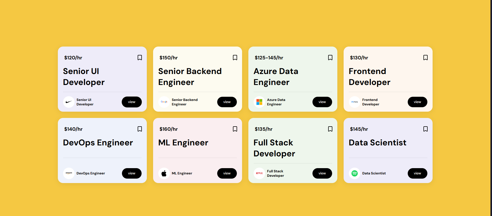

# Job Board UI

A static job board UI built with React and Vite. Job listings displayed in a responsive grid with company logos, salary ranges, and role titles.

---

### 📦 Stack

- **React 19** (Vite)
- **CSS**

---

### ✨ Quick start
```
npm install
npm run dev
```

---

### 🖼 Preview



---

### 🤖 How it works

The `Cards` component receives job data as props and renders each listing. Jobs are stored in an array in `App.jsx` and rendered using `.map()`:

- **Props** — each card receives rate, title, company, logo and background color
- **Grid layout** — 4 column CSS grid arranges the cards
- **Dynamic colors** — each card gets a unique background tint via props

---

### 📁 Project structure
```
src/
  components/
    Cards.jsx       # Job card component with props
  App.jsx           # Jobs data array and grid layout
  App.css           # Flexbox, grid and card styling
```

---

### 👤 Author

**Ahsyx** — [github.com/yourusername](https://github.com/Ahsyx)

---

### 📀 Preview

